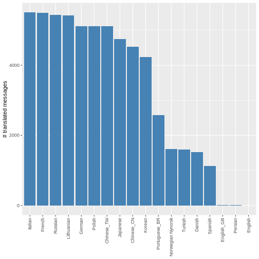

:::::::::::::::::::::::::::::::::::::: questions 

- What is the current status of translations in R?
- How can you find out more about the translations in your language of interest?

::::::::::::::::::::::::::::::::::::::::::::::::

::::::::::::::::::::::::::::::::::::: objectives

- Demonstrate the current status of translations in R
- Explore the Process for Localization (Translation) in R
- Explore mirror of [R source code](https://github.com/r-devel/r-svn)
- Introduction to `.pot` and `.po` files.


::::::::::::::::::::::::::::::::::::::::::::::::

## Introduction

There are two basic files with extensions `.pot` and `.po` that are usually required during the Translation process in R. The `.pot` files are the template files which contain the error messages, warnings, and other similar messages, in R. In the template `.pot` file these messages will be available in standard English against the placeholder `msgid "Standard English message is placed here"`. Below every `msgid` there will be a placeholder for the translated message called `msgstr ""` and it would always be empty (default) in the `.pot` file. The `msgstr` is to be filled in the corresponding `.po` file - to include the appropriate translation. Both the template `.pot` file and the translated `.po` file should stored in the same directory always.


::::::::::::::::::::::::::::::::::::: challenge 

## Challenge 1: Exploration 

Go through the dataset and example script available in the [translations directory](https://github.com/r-devel/rcontribution/tree/main/collaboration_campfires/translations). Explore the status of translations. 

There are three datasets available to use with this lesson: `metadata.CSV`, `message_status.csv`, and `4168b6fff27eafad68a4b134dba5c7d09e090fcb.csv`. Each of these datasets are described below: 

- The `metadata.csv` data file includes a `.csv` with one record per `.po` file in the R sources. There are 12 variables included in this dataset. The variable names and their description are provided in the table below:

| Variable name | Description |
| :--- | :--- |
| `sha`| The shortened SHA for the git commit of the r-svn repo that the data were obtained from|
|`date`| The date of the git commit of the r-svn repo that the data were obtained from|
| `package`| The name of a package containing messages to be translated|
| `po_file`| The name of `.po` files in the package sources |
| `component`| The `component` of the package the `.po` file relates to, either `C`, `R`, `RGui` (the latter is only in the base package)|
| `language`| The name of the language in English with the region as a suffix if applicable (e.g. `English_GB` vs `English`)|
| `r_version`| The name of the R version to `.po` file relates do (does not always match `pot_creation_date`)|
  | `bug_reports`| Where to report bugs related to this `.po` file|
  | `pot_creation_date`| The date the PO template file was created (when messages last updated), `YYYY-MM-DD` format|
  | `po_revision_date`| The date the `.po` file was revised, `YYYY-MM-DD` format|
  | `last_translator`| The name and email of the last translator|
  | `team`| The name and/or email of the translation team|

- The `message_status.csv` data file includes a `.csv` with one record per message in each `.po` file in the R source. It includes the variables `sha`, `date`, `package`, `po_file`, `component`, and `language` as above, plus:

| Variable name | Description |
| :--- | :--- |
|`message`| A message in the `.po` file|
|`translated`| A logical value indicating if the message has been translated|
|`fuzzy` | A logical value indicating if the translation is flagged as `fuzzy`, i.e. a fuzzy match of an old translation to a message that has had a minor update|

- The `4168b6fff27eafad68a4b134dba5c7d09e090fcb.csv` data file contains the results for the r-svn commit with hash `4168b6fff27eafad68a4b134dba5c7d09e090fcb`. This `.csv` has 6 columns described below:

| Variable name | Description |
| :--- | :--- |
|`git_commit`| The commit hash|
|`package`| The name of a package in the R sources|
|`language` |The ISO 639 code of the language, including variant|
|`type`| Either “C” or “R”|
|`n_translated` |The number of correctly translated messages|
|`n_untranslated` |The number of incorrectly translated messages|

Using the information available in the `message_status.csv` data file, a bar plot is created which shows the counts of correctly translated messages from the C or R code. The code used to generate this bar plot and the bar plot are provided below.


```r
# Load required packages
library(dplyr)
```

```{.output}

Attaching package: 'dplyr'
```

```{.output}
The following objects are masked from 'package:stats':

    filter, lag
```

```{.output}
The following objects are masked from 'package:base':

    intersect, setdiff, setequal, union
```

```r
library(forcats)
library(ggplot2)
library(readr)

# Read the data set
message_status <- read.csv("https://raw.githubusercontent.com/r-devel/rcontribution/main/collaboration_campfires/translations/message_status.csv")

# Plot the counts
ggplot2::ggplot(filter(message_status, translated, !fuzzy, component != "RGui"),
      aes(x = fct_infreq(language))) +
      geom_bar(stat = "count", fill = "steelblue") +
      theme(axis.text.x = element_text(angle = 90, vjust = 0.5, hjust = 1),
            legend.position = "none") +
      labs(x = NULL, y = "# translated messages")
```

<div class="figure" style="text-align: center">

<p class="caption">Correctly translated messages in base and default packages</p>
</div>


::::::::::::::::::::::::::::::::::::::::

:::::::::::::::::::::::::::::::::::::::::: challenge

## Challenge 2: Propose new metrics and plots

Using the datasets and the example code above, analyse the current state of translations in the R project, for the language(s) of your interest. Propose metrics, tables of plots to explore the translations data. You can modify the code above to produce the metrics, tables or plots.

Datasets available on the [r-devel/rcontribution](https://github.com/r-devel/rcontribution/tree/main/collaboration_campfires/translations) GitHub repository.

::::::::::::::::::::::::::::::::::::::::::


